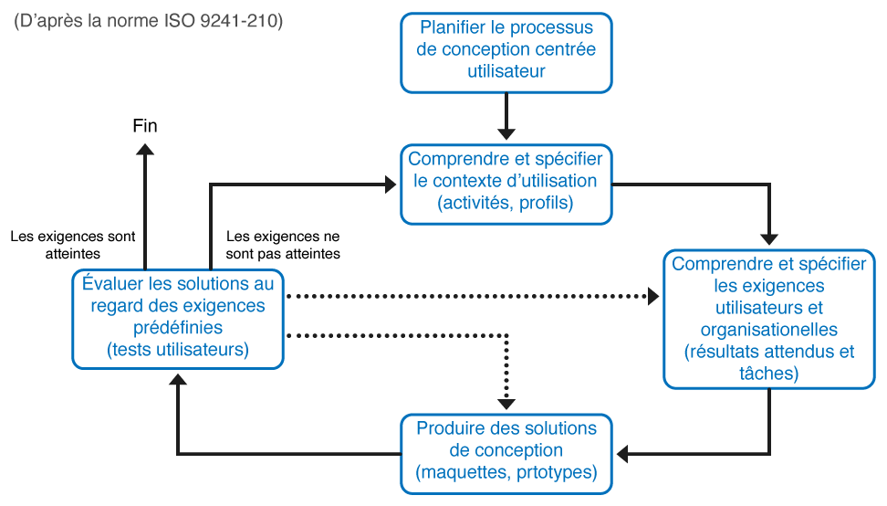
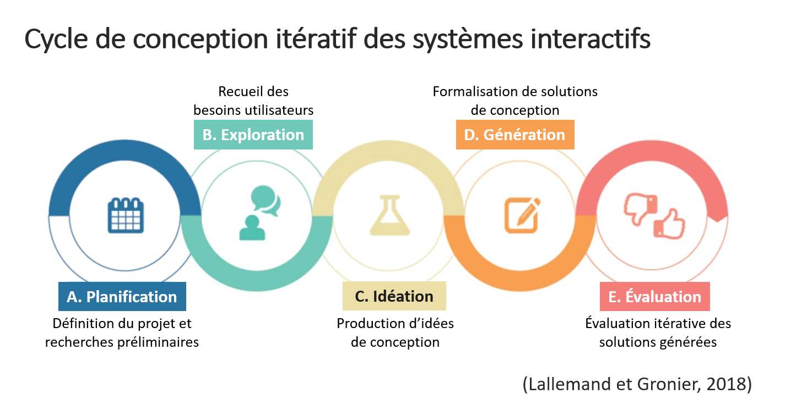

# Maquetage web site (UX)

## Author
* [Mathieu Vermeulen](https://sites.google.com/view/mathieuvermeulen/)

# Organisation du cours
Cette introduction s'intègre dans l'**UV CDAW** et participe au projet global par lequel vous serez évalué.

1. **Lundi 9 novembre (14h00 à 17h30)** Du blabla, des définitions, un peu d'ergonomie et de principes sur le graphisme (ou l'inverse). On parlera Planification, Exploration, Idéation, Génération, Evaluation, et tutti quanti.
2. **Mardi 10 novembre (9h00 à 12h30)** Le temps nous étant compté, nous irons droit au but : générer le squelette d'une application Web sur la base d'un template existant. Un peu de technique (HTML, CSS) et pas mal de créativité.
3. **Lundi 22 novembre (14h00 à 17h30)** Un créneau pour votre projet avec un accompagnement constructif :-)

# Évaluation du cours
Ce cours sera donc évalué au travers du projet que vous réaliserez lors de l'UV CDAW. Globalement, on s'intéresse ici aux aspects méthodologiques, graphiques, ergonomiques et imaginatifs. En gros, je vais observer vos compétences : 
* **organisationelles** (au niveau projet et travail collaboratif), 
* **artistiques** (pas votre niveau en dessin ou en musique, on est d'accord, mais votre capacité à créer du beau), 
* **d'analyse** (sur votre travail et celui de vos collègues),
* **d'ingénieur-designer responsable** (tout ça en même temps : j'ai un problème, je cherche une solution SMART, belle et durable)

Mais tout ça en moins d'un mois, je serai pragmatique :-D

# Introduction à l'UX Design, la conception centrée utilisateur
Le livrable de l'UV CDAW est de réaliser un site Web, ou plutôt une application Web, à partir d'un cahier des charges simplifié. Quand on parle de site Web ou d'application Web, on fait forcément référence à un usage et à des utilisateurs (à moins de faire du développement Web pour votre plaisir personnel). Depuis les années 2000 (mais on en parlait déjà en 1986 avec [Norman et Draper](https://dl.acm.org/doi/book/10.5555/576915) et le concept de Conception Centrée Utilisateurs ou CCU), l'expérience utilisateur (*User eXperience* ou UX) et l'*UX Design* (et par extension l'*UI Design*) a été mise en avant pour faciliter l'adéquation entre les outils et les humains qui les utiliseront. Tout ça peut paraitre évident, mais encore aujourd'hui, beaucoup de développement se font indépendamment des utilisateurs...

## L'eXpérience Utilisateur ?
Utilisé pour la première fois dans les années 1990, le terme "expérience utilisateur" (UX) a été défini par [Alben en 1996](https://dl.acm.org/doi/pdf/10.1145/235008.235010?casa_token=r4PsECmEGS8AAAAA:zZuL0kxKesVwqE-beAa7oKDI7RCWPhlvSbKg8C5aSfmU7bn65QlmVj7a8aKMqBkVxK42QiwlvVrbFg) par 
> tout les aspects liés à la manière dont les gens utilisent un produit intéractif : la sensation du produit dans leurs mains, la compréhension de son fonctionnement, le ressenti durant l'usage, l'accomplissement de leurs buts mais également son adéquation avec le contexte global dans lequel ils l'utilisent. (traduction du livre de [Lallemend et Gronier](bibliographie.md))

Par la suite, ce concept a été réutilisé à toutes les sauces et surtout compris de différentes manières. En fait, il n'y a pas consensus (ce qui est souvent le cas avec des définitions en langages vernaculaire). En général, on admet tout de même que l'UX est le résultat de l'interaction entre :
* l'utilisateur humain (ses attentes, ses besoins, sa motivation, etc.)
* le système (avec ses caractéristiques comme son but, ses fonctionnalités, son utilisabilité, etc.)
* le contexte (un fourre-tout mais qui donne les informations sur l'environnement dans lequel l'intéraction se fait,)

Ce qui pose problème, c'est que l'humain est complexe, le contexte peut l'être aussi. Et de fait on ne peut pas évaluer l'interaction entre l'humain et le systéme comme dans une chambre blanche...

Il existe pas mal de modèle de l'UX, on ne rentre pas dans les détails, mais c'est assez passionnant. Il existe même des modèles de méthodes de recherche en informatique centrée humain qui utilisne tces concepts (telle [THEDRE](http://thedre.imag.fr)). Si vous voulez en savoir plus, la [bibliographie](bibliographie.md) est là pour ça !

## UX Design, qu'est ce donc ?
L'UX Design consiste à tenir compte de l'expérience utilisateur dès le démarrage du projet, au début du cycle de conception d'un produit (site ou application Web dans notre cas). Il s'agit de concevoir pour eux, mais surtout avec eux. On se place dans le paradigme de la CCU qui est spécifiée par la norme ISO 9241-210. Lallemend et Gronier en donne les grandes lignes (avec ma libre adaptation) :
* Le processus de conception est basé sur une compréhension explicite et la plus complète possible des utilisateurs, de leurs tâches et de leurs environnements.
* Les utilisateurs sont impliqués **tout au long** de la conception et du développement du produit, qui sont guidés par des phases d'évaluations centrées sur ces utilisateurs.
* L'équipe de conception intègres des profils, des compétences et des perspectives pluridisciplinaires dans une approche participative et collaborative.
* La conception porte sur l'ensemble de l'expérience utilisateur, intégrant ainsi les composants liés à la performance du système (performance, fonctionnalités), mais aussi ceux liés à l'utilisateur (habitudes, personnalités, compétences).

Les activités liées à la CCU suivent un cycle itératif en quatre étapes.

En fait, l'UX Design est une généralisation de ce paradigme adapté aux Interactions Homme-Machine (IHM). Cela regroupe un ensemble de méthodes et de concepts permettant de mettre en place de manière effective la CCU pour les logiciels, les interfaces (on parle d'UI Design), le développement Web par exemple. Le mot est à la mode, mais il commence à être largement utilisé, parce que défini par les chercheurs, en particulier autour des modèles théorique de l'expérience utilisateur.

J'adhère volontiers au cycle (processus) suivant en 5 sous-processus (eux-même itératifs) :
1. **Planification** : définition des objectifs du projet et reflexion sur les outils et ressources à déployer.
2. **Exploration** : recueil des besoins utilisateurs.
3. **Idéation** : Synthèse du sous-processus d'exploration et production d'idées de conception.
4. **Génération** : formalisation de solutions de conception.
5. **Évaluation** : évaluation itérative des solutions générées.

De mon point de vue, l'UX Design fait le lien entre les sciences de l'informatique et les sciences humaines et sociales. Il faut comprendre l'humain pour permettre l'interaction avec la machine. Je vous conseille d'ailleurs de lire les articles de Turing ou à défaut le bouquin [Turing à la plage](https://www.dunod.com/sciences-techniques/turing-plage-intelligence-artificielle-dans-un-transat) (ou pourquoi on s'est amusé à créer des langages informatiques entre autres). Néanmoins et d'une façon générale, les principes de l'UX Design peuvent se généraliser à toute production (en lien avec l'informatique ou non) impliquant des utilisateurs humains, rejoignant alors les principes du Design (au sens premier du terme).

Pour chaque sous-processus, nous allons évoquer (malheureusement avec peu de détails étant donnée la durée du cours) des outils, des méthodes et des conseils qui permettent de mener à bien un processus global avec l'UX Design. Ce dernier étant assez récent, il apparait chaque année de nouveaux outils et de nouvelles méthodes. Il vous faudra au court de votre carrière réaliser une veille permanente pour pouvoir choisir ceux et celles qui conviendront.

## [Planification](planification.md) 
On va planifier ! Et préparer le projet pour que tout se déroule bien.

## [Exploration](exploration.md)
Si on avait le temps, on regarderait ce qui se fait du coté des SHS. En gros on va écouter les utilisateurs, même quand ils ne parlent pas.

## [Idéation](ideation.md)
Ça va être dur, mais il faudra être créatif. Et pour ça, on a des techniques. Tempête de cerveaux, par exemple.

## [Génération](generation.md)
Mettre en musique vos idées mais pas en dur, pas tout de suite. Maquette, icônes, storyboard et tutti quanti.

## [Évaluation](evaluation.md)
Évaluer, histoire de voir si vous n'êtes pas un créateur incompris, ou plutôt qui n'a pas compris.

# [Charte graphique](graphique.md)
Un trait ou une couleur, ça n'est pas neutre. Ici, on regarde quelques principes de bases.

# [Ergonomie (vite fait)](ergonomie.md)
L'ergonomie, c'est vaste. Prenons quelques minutes pour survoler cette discipline.

# [Bibliographie](bibliographie.md)
Lisez, vous mourrez moins bête. Mais vous mourrez quand même (merci [professeur moustache](http://tumourrasmoinsbete.blogspot.com/), oui vraiment [merci](https://www.arte.tv/fr/videos/RC-014384/tu-mourras-moins-bete/) !).
