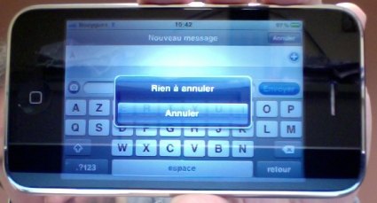

# Ergonomie (vite fait)

## Définitions
L'ergonomie est l'étude de la facilité et de la souplesse d'utilisation d'un système, ainsi que de sa bonne adaptation aux objectifs recherchés, en tenant compte du bien-être de l'utilisateur.

En informatique elle concerne aussi bien le matériel (écran pivotant, inclinable, agréable, sans clignotement, clavier à teinte matte, à touches bien disposées, ordinateur rapide et silencieux...) que le logiciel (productif, bien conçu et adapté à la tâche, mode d'emploi intuitif, avec aide en ligne contextuelle...) qui doit être en adéquation avec le mode de travail des utilisateurs et les objectifs de l'entreprise.

Elle intervient donc avant la conception logicielle d'un produit. Dans l'UX Design, l'ergonomie est assez centrale. On répond aux questions soulevées par les ergonomes en impliquant les utilisateurs à toutes les étapes et en ayant un recourt systématique aux tests utilisateurs.

### Le cas du Web
L'ergonomie d'un site Web, c'est sa capacité à rendre facile la recherche et l'accès à l'information, à transmettre un message, à remplir ses objectifs, à répondre aux attentes et besoins des internautes... et ce de manière pratique et agréable.

C'est la recherche d'un idéal : trouver le juste compromis entre utilité, beauté, fonctionnalité et simplicité.

## Considérations cognitives
Certains comportements face à l'écran (ou aux documents "visuels" en général) ont été analysés par les ergonomes (aspects cognitifs, processus d'intégration de l'information).

En fait, on retrouve des comportements classiques mis en avant par les chercheurs ergonomes ou IHM :
* La lecture en "Z".
* La perte d'attention due aux éléments animés.
* La surcharge d'informations sur un même espace.
* L'information détournée par des éléments graphiques secondaires.
* Dans le cas Internet, les menus mouvants, les actions sur simple clic, les curseurs personnalisés, etc.

## Situations inextricables
Certaines situations n'offre aucune solution à l'utilisateur. Il est malheureusement encore fréquent de rencontrer ces situations au quotidien. Elle peuvent être :
* des messages incompréhensibles (phrases alambiquées, vocabulaire trop spécifique, etc.),
* des instructions sans solutions évidentes (boutons aux libellés identiques, pas de boutons sur une pop-up, etc.),
* une navigation qui boucle.

Des exemples un peu anciens mais vécus en vrai par moi-même :-)

## Soucis structurels ou culturels

Les erreurs structurelles concernent des éléments ou des libellés inadaptés au sein des interfaces. Ces erreurs gênent l'utilisateur dans l'usage du logiciel ou du site Web, quelquefois de manière imperceptible, et renforce un sentiment d'amateurisme.

Les erreurs de type culturelles sont des éléments inadaptés au public cible soit au niveau des usages, soit au niveau du vocabulaire, soit enfin au niveau graphique. Il est extrêmement important de connaître les aspects culturels du pays cible, de la communauté ciblée, etc.

