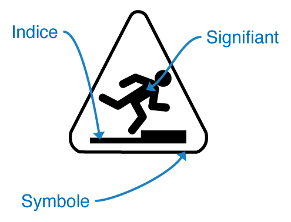

# Génération
Ce sous-processus est celui où vous allez mettre les mains dans le cambouis : créer les prototypes et maquettes de système à concevoir, c'est-à-dire les représentations physiques des solutions imaginées dans la phase d'idéation, avec lesquels votre équipe pourra intéragir et qui pourront être évaluer par les utilisateurs. Générer et explorer un ensemble d'alternatives possibleset faire des choix éclairés par les évaluations successives est de fait la base de l'UX Design.

Cette démarche itérative jalonnée par des évaluations avec les utilisteurs permet d'affiner les prototypes et maquettes, parfois en les combinant entre elles, pour atteindre un niveau de qualité et de fidélité de plus en plus important. En bref : il faut mettre vos idées en musique en évitant la cacophonie !

Il existe encore une fois pas mal de méthodes et d'outils pour créer des prototypes. Nous allons nous concentrer sur 3 d'entre eux en proposant une gradation du moins intéractif au plus plus réaliste.

## Iconographie
Une image vaut-elle mieux qu'un long discours ? La plupart du temps sans doute, encore faut-il que cette image soit bien comprise. Depuis la création des interfaces dites graphiques au début des années 1980, les icônes sont omniprésentes dans les logiciels. Associées à une interaction, elles favorisent une simplification des actions de l'utilisateur (évitant ainsi des lignes de commandes difficiles à comprendre pour le néophyte). Pour autant la création d'icônes n'est pas simple : il faut tenir compte des habitudes des utilisateurs, du contexte social et culturel, etc.

Il vaut mieux associer un texte à une icône : le premier est moins ambigu, la seconde est plus rapidement comprise et repérée.

## Composition des icônes
Les icônes sont composées de différents éléments :
* le signifiant (le coeur de l'icône e.g. une personne, un objet, etc.)
* les indices (pour guider l'interprétation du signifiant e.g. une flèche, un trait, etc.)
* les symboles (pour donner un sens particulier au signifiant e.g. rouge pour un interdit, dont il ne faut pas abuser parce qu'ils peuvent brouiller le message).

## Créer une icône
La conception des icônes suit le processus suivant : 
* choix du format de celles-ci;
* planification de la méthode (définir le contexte d'usage, construire une grille de passation avec un concept à faire dessiner par les utilisateurs, recrutement des utilisateurs);
* passation (ravailler avec les utilisateurs sur leurs représentations mentales, faire dessiner des icônes);
* analyse des résultats. 

On finit par une phase d'exploration des résultats où l'icône, une fois correctement interprétée par les utilisateurs (80% d'entre eux), va être affinée pour atteindre une qualité suffisante.

Et si vous avez la flemme, il existe des [sites très bien](https://fontawesome.com/), pourvu que vous fassiez une évaluation comme il faut de vos choix :-)

## Storyboarding
Un storyboard est la représentation sous forme de bande dessinée simplifiée de votre système. Avec ces courts récits illustrés, vous allez représenter les intéractions entre les utilisateurs et votre système. Cette méthode narrative a pour objectif de raconter les scénarios utilisateurs que vous avez imaginé en amont. Inutile d'être un dessinateur professionnel, le storyboard doit permettre de valider vos choix et c'est surtout sa structure narrative qui compte. Ces concepts sont largement repris dns le *Storytelling*, un paradigme très à la mode dans la conception depuis quelques années. De plus, cette approche narrative se retrouve dans le *Design Thinking* et le *sketching*, des méthodes qui font appel à la pensée visuelle.

Plusieurs perspectives sont possibles pour faire un storyboard :
* la perspective écologique, centrée sur le système dans son contexte. On ne rentre pas dans les détails de son fonctionnement;
* la perspective d'intéraction, centrée sur les écrans et l'interface, sur les actions de l'utilisateur et de ses réactions face au système;
* la perspective émotionnelle, centrée l'expérience et les émotions qu'elle suscite.

L'avantage du storybard est de propsoer un format simple avec lequel vous allez pouvoir communiquer que ce soit auprès des utilisateurs (et donc pour évaluer vos propositions) ou auprès de vos collègues (équipe ou hiérarchie).

Son défaut est de ne pas permettre de représenter des éléments détaillés. Vous serez parfois freiné par votre humilité naturelle quant au dessin (ainsi que vos collègues). Et oui, on a toujours peur de passer pour un mauvais dessinateur :-)

Je vous conseille d'aller voir le site [Storyboardthat](http://www.storyboardthat.com) qui propose pas mal d'example (avec le mot clé IHM par exemple). 

## Maquettage
Pas besoin d'en dire beaucoup sur cette méthode, une maquette est un passage quasi-obligatoire pour tout projet de conception. Pour ce qui nous concerne, le design d'interface, il existe une multitude d'outils pour maquetter des interfaces d'auatnt plus faciles à utiliser si vous avez créé vos icônes et réalisé des storyboards.

Leur avantage est de proposer une visualisation quasi-fonctionnelle de votre système. Plusieurs formats sont possibles, en fonction du niveau de détails, d'intéractivité, de la taille, de la capacité à évaluer (maquette jetable ou incrémentables), de leur orientation (horizontale ou verticale, tâches ou scénario).

On choisit aussi un modèle de maquette en fonction de sa diffusion future, de son niveau d'audience possible. **N'oubliez pas que le but de la maquette est l'évaluation de vos idées !**

Pour plus d'information sur les outils de maquettage, la [biblio](bibliographie.md) est là. Et le site qui sert : [Prototypr.io](https://prototypr.io/)

## Les autres
Design persuasif, Tri de cartes, Gamification, etc.

