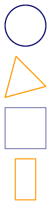
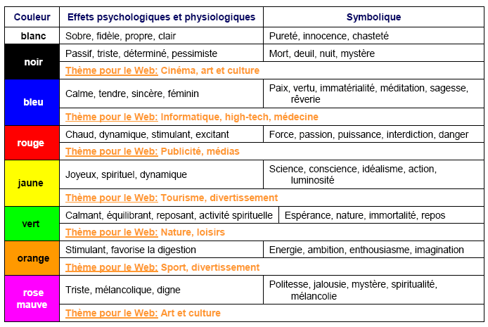
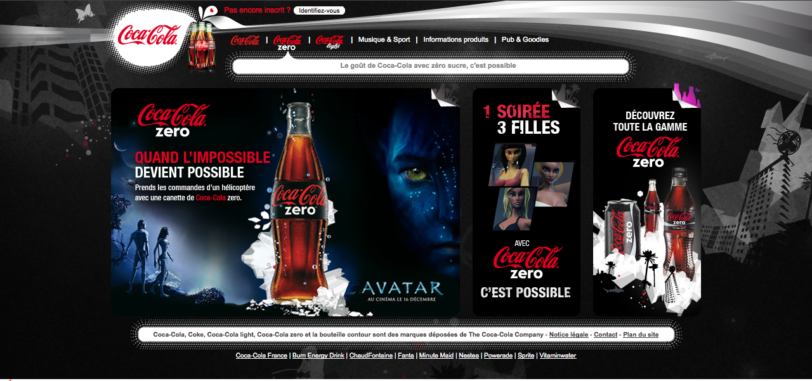
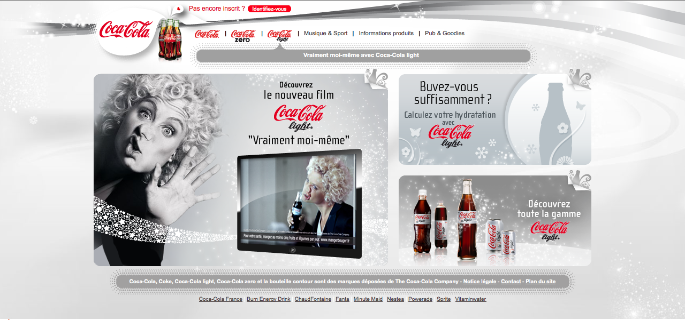

## Graphismes et charte graphique

**Définition** La charte graphique, est un document de travail qui contient l'ensemble des règles fondamentales d'utilisation des signes graphiques qui constituent l'identité graphique d'une organisation, d'un projet, d'une entreprise. [Wikipédia](https://fr.wikipedia.org/wiki/Charte_graphique)

Elle est indispensable pour :
* Unifier l'aspect un document.
* Donner une identité visuelle.
* Véhiculer une image, un style graphique et contrôler cette image.
* Partager la production de documents entre différents acteurs.
* Assurer une homogénéité à l'intérieur de entreprise.

**Attention** :	La charte graphique doit être originale et esthétique. Et ça, c'est pas gagné !

Break : un exemple comme ça en passant, [Charte graphique de l'Université de Cergy](resources/charteGraphiqueUnivCergy.pdf)

# Règle de conception (et de lecture)
Il s'agit de créer un document regroupant les différents aspects graphiques des réalisations à venir. Pour cela il faut convenir de la forme et de l'aspect d'un certain nombre d'éléments. Il faut évaluer le ressenti de votre charte (ce que les designers appellent le "*Watch and feel*").

Voici une liste (non exhaustive) des éléments dont il faut tenir compte :
* Le mélange du statique et du mouvement (image, animations, etc.)
* La mise en page et l'équilibre de celle-ci.
* Le choix et utilisation des lettres, des couleurs, de l'espace, des lignes, etc.
* La qualité visuelle de la typographie et de la photographie.
* L'image à véhiculer.

**La première impression est importante en générale !**
* Sur un site Web bien sûr sinon l'utilisateur risque de déserter le site (et donc avoir une mauvaise image de l'entreprise ou de votre projet en général.)
* Sur vos productions, ce qui peut avoir une influence sur l'idée qu'on se fait de vous.

Sur beaucoup de point, l'esthétique et le design de la charte graphique rejoint l'ergonomie de vos documents finaux (on en reparlera [ici](ergonomie.md)).

**On définit toujours la forme avant les couleurs !**

En général il est utile de se poser quelques questions avant de réfléchir à une charte graphique.
* Quel public visez-vous ?
* Quels types de documents voulez-vous construire ?
* Quels messages voulez-vous faire passer ?
* Quelle image voulez-vous donner ?

# Concepts
## Lignes
La **verticale** évoque la force, la dignité, la vérité. Elle s'apparente aussi à la rigidité, à l'immobilisme.
L'**horizontale** est synonyme de calme, de repos, de tranquillité, d'horizons largement ouverts. Mais aussi, tel un gisant, de mort.
L'**oblique** symbolise le mouvement, le dynamisme. Mal utilisée, elle se transforme en chute.
La **droite** est la figure la plus simple, la plus directe. Rigueur, décision, mais aussi ennui.
La **courbe** s'apparente à la plénitude, à la féminité. Mais elle évoque également la mollesse.
La **ligne brisée** est souvent signe d'agitation, de confusion.
Les **lignes convergentes, divergentes** sont ambiguës. Elles signifient à la fois: choc, violence mais aussi expansion, éloignement.

## Formes
Le **cercle** est synonyme de perfection, d'absolu, d'infini.
Le **triangle** représente l'harmonie, la proportion, la sécurité.
Le **carré** est solide, stable. Il symbolise l'absence rassurante de tension. C'est le support idéal pour une information neutre et objective.
Le **rectangle** s'apparente au carré. Présenté à la française, c'est-à-dire à la verticale, il est plus dynamique. A l'italienne, c'est-à-dire à l'horizontale, il produit un effet panoramique.

## Couleurs
### Symbolique

### Mélange des couleurs
Vous devez tenir compte aussi bien des valeurs (nuances de gris) que des couleurs. Le choix des couleurs se base sur des critères le plus souvent esthétiques (vos goûts en quelque sorte), mais ce choix doit plaire à vos "lecteurs". Vous devez tenir compte de l'emplacement de vos couleurs.

En général, le test est le meilleur révélateur de mélanges ratés : fond bleu + écriture rouge, fond foncé + écriture foncé, etc.

Nous verrons par la suite que l'ergonomie pose certaines contraintes (pas plus de cinq couleurs sur une page par exemple).

### Association de couleurs
Il va de soit que certaines couleurs se marient mal entre elles et il peut y avoir de grandes différences entres les associations de couleurs sur un écran (Web) et celles "sur le papier".

Pour choisir vos couleurs, il existe des [sites permettant d'associer des couleurs](http://paletton.com/) et de générer une maquette Web afin de valider vos choix (et même de les faires valider par des utilisateurs). 

# Quelques exemples
## Les logos
Le logo va être le représentant visuel d'une une entreprise, une marque mais aussi un projet ou une équipe au sein d'une entreprise. Avant même de lire la marque (ou le nom du produit, le titre du site...), l'oeil reçoit déjà une information visuelle par l'intermédiaire du logo.

Il véhicule :
* des valeurs,
* une image, un message.

Il s'agit de définir un certain nombre de paramètres avant de créer un logo.
* Choix des couleurs
* Ajout d'un dessin (type « mascotte », produit, valeur symbolisée...) ou non
* Choix de la typo
* Forme générale

## La communication par le design graphique
Certaines marques ont largement montré l'intérêt du graphisme dans la communication tel Apple (en particulier avec l'épisode de l'iPod) ou Coca-Cola.

