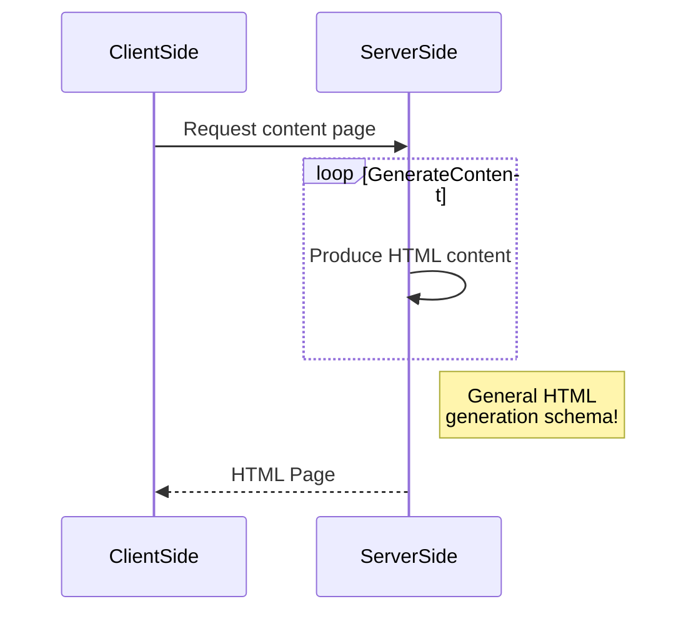

****************************************
## Titre de niveau 'nombre de #'
Texte
*Texte* italic
**Texte** bold
`Texte` code
> Texte mode citation
```css
For while (code informatique non interprété)
```

[label du lien : aller vers Google](http://www.google.fr) lien web


Super séléction : command+option+shift+bas
* T1
* T2
* T3 liste à puce

1. t1
2. t2
3. t3 liste numérotée



