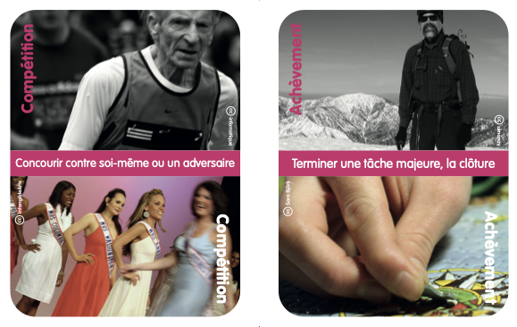

# Idéation
Ce sous-processus vise à l'émergence d'idées sur la base des données recueillies avec les utilisateurs. Il existent beaucoup de méthodes pour favoriser l'émergence d'idées. Mais mon expérience m'a montré que seules quelques unes d'entre elles fonctionnent avec une majorité de personnes. Mais surtout le fondement théorique de certaines méthodes sont parfois difficile à appréhender. Dans cette partie, je n'en présenterai que deux (enfin un et petit bout de l'autre), libre à vous de creuser la question :-)

## Brainstorming
La "tempête de cerveaux" est la plus connues et la plus commune des techniques de génération d'idées. Elle est apparut ddans les années 1930 et rencontre toujours le succès.

Une séance de brainstorming se déroule selon le plan suivant :
* un groupe de participant émet un maximum d'idées sur une thématique donnée. Aucun jugement (ni aucune critique) ne doit être formulé sur ces idées.
* les idées sont notés par un modérateur qui veille aux respects des 3 règles : **spontanéité**, **pas de jugement** (!), **encourager les idées extravagantes** et **fertilisation croisée**.

Cette méthode a l'avantage de renforcer la cohésion d'un groupe par la co-construction d'une solution à un problème.

Pour créer cette activité, il faut préciser :
* la question ou le problème principal;
* la durée de la session (entre 10 et 60 minutes avec pauses pour les plus longues);
* le nombre de participants (entre 5 et 12 et plutôt moins de 10);

Le modérateur oou animateur a un rôle central. Il doit
* donner les instructions (avec les 4 règles) et exposer le problème;
* avoir une attitude positive;
* garder le rythme;
* gérer le groupe;

Le résultat est une liste d'idée en vrac qu'il faudra trier, évaluer à l'aide d'outils telle une matrice de priorisation ou une grille multicritère.

## Cartes d'idéation
Les cartes sont un outil emblêmatique de l'UX Design. Les cartes d'idéation visent à stimuler l'émergece d'idées nouvelles. Il en existent des dizaines, souvent basés sur les recherches en UX design (elles sont utilisées pour mener des expérimentations dans ce domaine).

Pour donner un exemple, voici quelques cartes de l'outil PLEX Cards ([le site](http://www.funkydesignspaces.com/plex/), [l'article](bibliographie.md), [les cartes en français](http://www.funkydesignspaces.com/plex/PLEX_Cards_French.pdf))

Vous avez les règles d'utilisation, les explications, les fondements scientifiques. Y'a plus qu'à :-)

Blague à part, il faut vous approprier un de ces outils, le comprendre et comme pour le brainstorming, apprendre à modérer et animer une séance avec celui-ci.

## Beaucoup d'autres
Si vous souhaitez creuser la questions : Personnas, Design studios, Experience maps, techniques génératives
