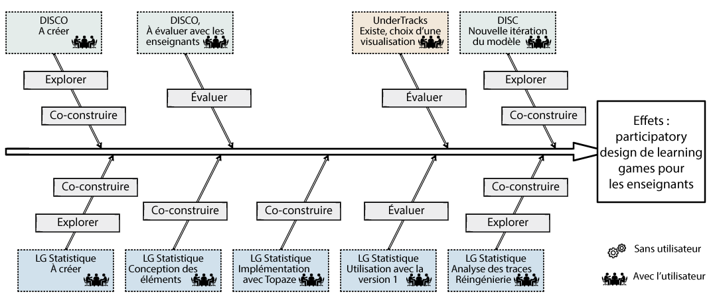

# Planification
Cette phase est cruciale pour bien démarrer un projet en UX Design. Il faut impliquer toutes les parties prenantes du projet, comprendre son ecosystème et les enjeux de celui-ci. En gros, comme dans tout problème, il faut appréhender toutes les données initiales disponibles. 

## Définition du projet
Vous disposez d'un très court cahier des charges. Il vous faut le compléter en réalisant diverses actions avec différents outils et méthodes.

### Impliquer les parties prenantes
Ici tout est affaire de communication :
* mener des entretiens individuels avec vos collègues impliqués dans le projet, de préférence semi-structurés (des questions ouvertes mais dans la thématique) et informel (restez naturel);
* organiser une réunion de lancement pour confronter les points de vues (et basée sur les entretiens précédemment menés), mais aussi pour convaincre de l'intérêt de la démarche UX Design (et oui tout le monde ne pense pas forcément comme vous !). Parmi les outils sympa, [UX sales deck de Boag](https://boagworld.com/ux-culture-cards) peut vous aider dans cette démarche.

### Planifier la démarche UX Design
Il faut alors sélectionner les outils et méthodes de recherche qui permettront de comprendre besoins et motivations des utilisateurs.
* Rechercher des utilisateurs est primordial; il faut comprendre leurs besoins, développer une forme d'empathie envers eux, former une base sur laquel vos futurs idées prendront place. De nombreux auteurs considèrent que la recherche utilisateurs se décline en 3 phases :
1. **Planification de la recherche**. Élaborer des stratégies, émettre des hypothèses, scénariser et préparer.
2. **Passation**. Faciliter, observer, écouter, collecter.
3. **Analyse**. Grouper, synthétiser, cartographier, comprendre.
* Orchestrer les activités et phases ultérieures; vous devez définir vos outils et méthodes pour chaque sous-processus de la démarche. Le diagramme d'Ishikawa ou en arrêtes de poisson est un outil intéressant pour orchestrer ces activités.

## État de l'art (multi-domaine)
Comme tout projet de production, une recherche sur l'existant est indispensable. Il existe plusieurs sources pour réaliser cette recherche.
1. La recherche documentaire : fouiller la littérature scientifique (artciles de recherche), les ressources professionnelles (blog, associations professionnnelles telle [FLUPA](http://flupa.eu)), les bases de propriétés industrielles (INPI par exemple).
2. Les ressources internes à votre entreprise.
3. L'analyse concurrentielle au travers par exemple des études de marché.

## Recrutement des utilisateurs
Recruter les utilisateurs (on dit parfois utilisateurs finaux ou cibles) est une étape importante à ne pas négliger. Comment doit-on les sélectionner ? Combien en faut-il ? Comment organise-t-on les sessions de travail avec eux ?

Pour identifier les utilisateurs à recruter, des discussions dans votre équipe (en mode *brainstorming* par exemple) doivent être menées au préalable. Puis il faut décrire les caractéristiques de ces utilisateurs : démographique, liées à la tache, organisationelles ou psycho-cognitives. Enfin, il convient de sélectionner les utilisateurs représentatifs (avec en particulier les méthodes d'échantillonnage). On ne rentre pas dans les détails, je vous renvoie au livre de [Lallemand et Gronier](bibliographie.md) (je n'ai pas d'actions, mais il faut avouer qu'il est très bien fait !).

Le recrutement en tant que tel peut alors se faire. Le nombre d'utilisateurs à recruter dépend de l'objectif de votre étude et des méthodes que vous utiliserez (définies dans la phase "Planifier la démarche UX Design"). Le recrutement peut être géré par vous même ou par un cabinet extérieur et vous devrez choisir le mode de filtrage, les méthodes pour motiver et récompenser les participants. Vous devrez alors organiser les sessions, non sans les avoir pré-tester et planifier au préalable. 

## Éthique, déontologie
L'éthique est un sujet complexe et souvent subjectif. Il faut en tenir compte dans **tous projets impliquant des humains** (voir des êtres vivants). Vous trouverez beaucoup de littérature sur le sujet et de nombreux docuements pour encadrer vos démarches : [Ethical Design](https://2017.ind.ie/ethical-design/), [UXPA](https://uxpa.org/), etc.

Vous devez aussi connaitre, avant de démarrer votre projet, les grands principes déontologiques et légaux. Bien sûr, les lois (telle la RGPD dont on parle beaucoup ces derniers mois) encadrent ce type de démarche, surtout quand il s'agit de recueillir et potentiellement de stocker des données sur des personnes. Un point qui me semble important est de permettre aux utilisateurs de donner leur consentement libre et éclairé quant à leur participation à vos travaux. Pour cela, pensez à leur faire signer un formulaire de consentement bien construit. Aller, un exemple :[Notice de consentement pour le projet de recherche APACHES](resources/120191108_consentement_notice.pdf)